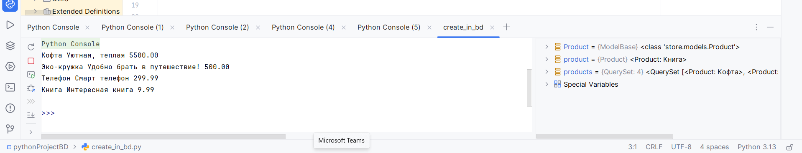
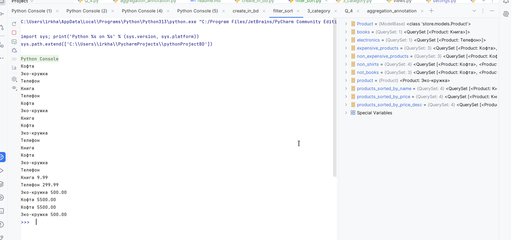
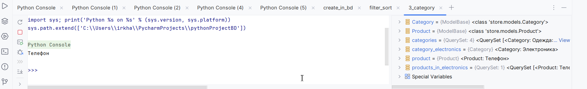
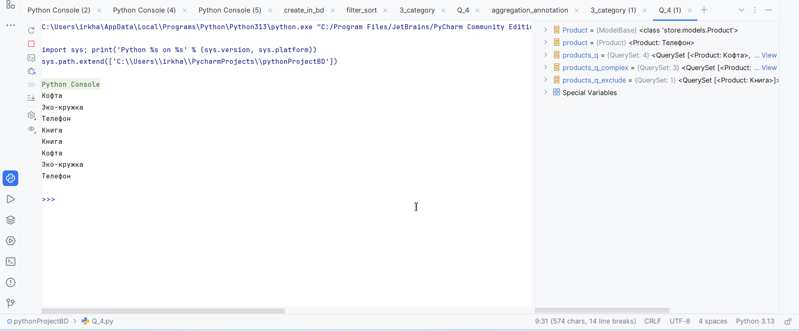
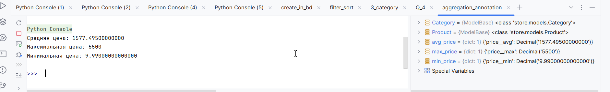

#1 Создание продуктов и Запрашиваем все записи

#2# Продукты с ценой больше 20, с названием, содержащим 'Книга', созданные в категории 'Электроника',цена которых не равна 299.99, название которых не содержит 'Футболка', которые не находятся в категории 'Книги', по возрастанию цены,  по убыванию цены , отсортированные по названию

#3 Получение данных
#get_products_in_category(category_name): Получает все продукты в указанной категории.
#get_all_orders(): Получает все заказы.
get_reviews_for_product(product_name): Получает все отзывы для указанного продукта.
get_product_details(): Получает названия и цены всех продуктов.
get_order_info(): Получает информацию о всех заказах (ID и статус оплаты).
get_product_names_in_category(category_name): Получает названия продуктов в указанной категории.
get_order_ids(): Получает идентификаторы всех заказов.
get_review_ratings_for_product(product_name): Получает рейтинги отзывов для указанного продукта.

#4 Продукты с ценой больше 20 или с названием 'Книга', с ценой меньше 20 и в категории 'Одежда', с названием, содержащим 'Телефон' или с ценой выше 100

#5 # Средняя цена продуктов, Максимальная цена продуктов, Минимальная цена продуктов
